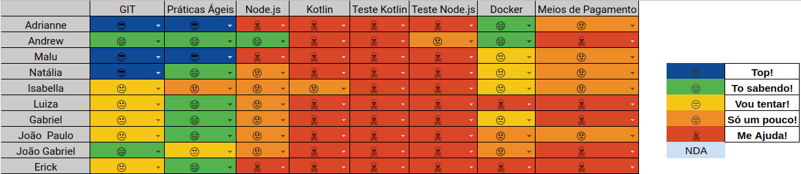

# Resultado

## 1. Indicadores de Produtividade da Equipe

### 1.1 Fechamento da Sprint 

**Pontos planejados: 15 pontos**
 
**Pontos concluídos: 15 pontos**

| Atividade | Situação |
| --------  | :----:   |
| [S01](https://github.com/fga-eps-mds/Projeto01/issues/1)      |Concluída | 
| [S05](https://github.com/fga-eps-mds/Projeto01/issues/5)      |Concluída | 
| [S06](https://github.com/fga-eps-mds/Projeto01/issues/6)      |Concluída | 

## 1.2 Burndown
Zenhub não criado no momento dessa sprint

## 1.3 Velocity   
Zenhub não criado no momento dessa sprint

## 1.4 Retrospectiva 

### Grupo 1

| Membro | Pontos Positivos | Pontos Negativos | Sugestão de Melhoria | Pontuação das Histórias |
| --------  | :----:   | :----:   | :----:   | :----:   |
| Adrianne | EPS conseguiu dar treinamentos  | Não tínhamos tema e estávamos perdidos com relação ao escopo | Não se aplica | OK |
| Andrew | A equipe estava presente nos treinamentos | Não ter uma tecnologia definida o que atrasou os estudos | Não se aplica | OK |
| Maria Luiza | Definição das equipes | Não ter tema definido e nem tecnologia | Não se aplica | OK |
| Isabella | Treinamentos produtivos | Perdida em relação a disciplina | Não se aplica | OK |
| Luiza | Conseguir um grupo de EPS, treinamentos produtivos | Demora na definição de tema, o que causou o atraso, não gostei do BOT do telegram da Daily| Não se aplica | OK |

### Grupo 3

| Membro | Pontos Positivos | Pontos Negativos | Sugestão de Melhoria | Pontuação das Histórias |
| --------  | :----:   | :----:   | :----:   | :----:   |
| Adrianne | EPS conseguiu dar treinamentos  | Não tínhamos tema e estávamos perdidos com relação ao escopo | Não se aplica | OK |
| Andrew | A equipe estava presente nos treinamentos | Não ter uma tecnologia definida o que atrasou os estudos | Não se aplica | OK |
| Maria Luiza | Definição das equipes | Não ter tema definido e nem tecnologia | Não se aplica | OK |
| Isabella | Treinamentos produtivos | Perdida em relação a disciplina | Não se aplica | OK |
| Luiza | Conseguir um grupo de EPS, treinamentos produtivos | Demora na definição de tema, o que causou o atraso, não gostei do BOT do telegram da Daily| Não se aplica | OK |

### Grupo 4

| Membro | Pontos Positivos | Pontos Negativos | Sugestão de Melhoria | Pontuação das Histórias |
| --------  | :----:   | :----:   | :----:   | :----:   |
| Guilherme S. | Boa apresentação da matéria  | Não tínhamos tema e estávamos perdidos com relação ao escopo e ferramentas | Não se aplica | OK |
| Arthur T. | Primeiro contato com projeto de software | Grupo perdido em relação ao escopo | Não se aplica | OK |
| Thiago O. | Primeiro contato com projeto de software | Falta de dedicação | Melhor disciplina | OK |
| Thiago V. | Apresentação dos membros do grupo | Falta de tema e grupo perdido | Não se aplica | OK |
| Matheus F. | Oportunidade de aprendizado | Dificuldade de organização | Não se aplica | OK |
| Pedro A. | Primeiro contato com projeto de software | Falta de tema e organização | Não se aplica | OK |
| João P. | Contato com a disciplina de MDS | Falta de competências e organização | Não se aplica | OK |

## 1.6 Quadro de conhecimento

# 2. Visão do Tech Leader
Essa sprint não tem muito como avaliar, devido a falta de referência com outras iterações e a falta de escopo de projeto.

Foram planejados treinamentos para MDS de práticas ágeis e conteúdos técnicos, a fim de expandir o conhecimento da equipe de desenvolvimento. Foi feito um quadro de conhecimento no momento em que a equipe foi decidida, o que evidenciou a pouca experiência da equipe de MDS.  

O objetivo da sprint foi concluído com sucesso, onde foi passado todo o conhecimento básico e o contexto da disciplina para a equipe de MDS para dar início ao projeto. 

O problema se encontrou no fato de não termos escopo do projeto definido, o que dificultou o andamento do mesmo. Com isso, as práticas ágeis ficaram comprometidas nessa sprint. 
