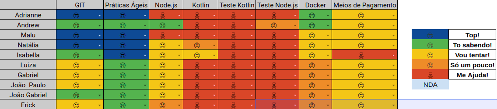

# Resultados 

## 1. Indicadores de Produtividade da Equipe

### 1.1 Fechamento da Sprint 

**Pontos planejados: 25 pontos**
 
**Pontos concluídos: 25 pontos**
 
**Dívida para a próxima Sprint: 0 pontos**
 
**Pontos Cancelados: 0 pontos**

| Atividade | Situação |
| --------  | :----:   |
| [D01 - Pesquisa de Tecnologias ](https://github.com/fga-eps-mds/Projeto01/issues/7) | Concluida |
| [D02 - Fazer Documento de visão](https://github.com/fga-eps-mds/Projeto01/issues/8) | Concluida |
| [D03 - Fazer Termo de abertura de projetos](https://github.com/fga-eps-mds/Projeto01/issues/10) | Concluida |
| [D04 - Fazer Documento de Arquitetura](https://github.com/fga-eps-mds/Projeto01/issues/11) | Concluida |

## 1.2 Burndown
Zenhub não criado no momento dessa sprint

## 1.3 Velocity   
Zenhub não criado no momento dessa sprint

## 1.4 Retrospectiva 

### Grupo 1

| Membro | Pontos Positivos | Pontos Negativos | Sugestão de Melhoria | Pontuação das Histórias |
| --------  | :----:   | :----:   | :----:   | :----:   |
| Adrianne | EPS conseguiu dar treinamentos  | Não tínhamos tema e estávamos perdidos com relação ao escopo | Não se aplica | OK |
| Andrew | A equipe estava presente nos treinamentos | Não ter uma tecnologia definida o que atrasou os estudos | Não se aplica | OK |
| Maria Luiza | Definição das equipes | Não ter tema definido e nem tecnologia | Não se aplica | OK |
| Isabella | Treinamentos produtivos | Perdida em relação a disciplina | Não se aplica | OK |
| Luiza | Conseguir um grupo de EPS, treinamentos produtivos | Demora na definição de tema, o que causou o atraso, não gostei do BOT do telegram da Daily| Não se aplica | OK |

### Grupo 3

| Membro | Pontos Positivos | Pontos Negativos | Sugestão de Melhoria | Pontuação das Histórias |
| --------  | :----:   | :----:   | :----:   | :----:   |
| Adrianne | EPS conseguiu dar treinamentos  | Não tínhamos tema e estávamos perdidos com relação ao escopo | Não se aplica | OK |
| Andrew | A equipe estava presente nos treinamentos | Não ter uma tecnologia definida o que atrasou os estudos | Não se aplica | OK |
| Maria Luiza | Definição das equipes | Não ter tema definido e nem tecnologia | Não se aplica | OK |
| Isabella | Treinamentos produtivos | Perdida em relação a disciplina | Não se aplica | OK |
| Luiza | Conseguir um grupo de EPS, treinamentos produtivos | Demora na definição de tema, o que causou o atraso, não gostei do BOT do telegram da Daily| Não se aplica | OK |

### Grupo 4

| Membro | Pontos Positivos | Pontos Negativos | Sugestão de Melhoria | Pontuação das Histórias |
| --------  | :----:   | :----:   | :----:   | :----:   |
| Guilherme S. | Andamento do projeto, melhor noção do escopo | Mal organizado e falha no uso do git| Realização de treinamentos git | OK |
| Arthur T. | Clareza nos objetivos do tema | Comunicação entre os grupos falha | Organizar mais reuniões | OK |
| Thiago O. | Melhora na organização | Comunicação entre os grupos falha | Maior utilização das ferramentas de comunicação | OK |
| Thiago V. | Entendimento do andamento da matéria | Dificuldade de divisão das issue | Dedicar mais tempo para a matéria | OK |
| Matheus F. |  |  |  | OK |
| Pedro A. | Melhor entendimento do projeto | Falta de colaboração entre os grupos | Melhorar a comunicação | OK |
| João P. |  |  |  | OK |

## 1.6 Quadro de conhecimento

# 2. Visão do Tech Leader

Foi planejado para essa sprint 30 pontos e só foi concluído 12 pontos, evidenciado no Velocity. Isso serviu de bastante aprendizado para a equipe, visto que várias das atividades planejadas não foram concluídas, o que resultou em métricas críticas para o projeto. Esse fato ocorreu devido a instabilidade e a falta de entendimento do projeto por parte da equipe.

A história [D05 - Fazer Protótipo de Baixa Fidelidade](https://github.com/fga-eps-mds/2019.2-Grupo2/issues/12) foi cancelada, devido a não necessidade de protótipo de baixa fidelidade, visto que a ideia e as telas do cliente já estavam bem consolidadas. O que resultou na decisão de cancelar essa tarefa.	

A reunião com o cliente ocorreu no meio da sprint, o que dificultou a iniciação das tarefas tanto por parte da equipe de MDS, quanto da equipe de EPS. Este fato resultou no Burndown, onde a equipe só conseguiu realizar as tarefas no último dia. 

Outro ponto crítico indicado pelos membros da equipe foi a comunicação dentro da equipe. Visto que não estava havendo muita interação entre os membros de EPS e MDS. 

As práticas ágeis foram aplicadas, com reuniões diárias via Telegram e reuniões semanais de planejamento ocorrida no início da sprint. Além das reuniões de retrospectiva e revisão ocorridas no final da sprint. Essas reuniões ocorrem todos os sábados presencialmente. 
