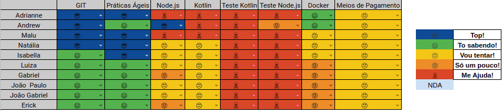

# Resultados 

## 1. Indicadores de Produtividade da Equipe

### 1.1 Fechamento da Sprint 

**Pontos planejados: 23 pontos**
 
**Pontos concluídos: 17 pontos**
 
**Dívida para a próxima Sprint: 5 pontos**
 
**Pontos Cancelados: 0 pontos**

| Atividade | Situação |
| --------  | :----:   |

| [T01 - Pesquisa Front-end](https://github.com/fga-eps-mds/Projeto01/issues/13) | Concluído | 
| [T02 - Pesquisa - Back-end](https://github.com/fga-eps-mds/Projeto01/issues/14) | Concluído  |
| [T03 - Inicio do Documento de EAP](https://github.com/fga-eps-mds/Projeto01/issues/15) | Concluído |
| [T04 - Organização do Zenhub](https://github.com/fga-eps-mds/Projeto01/issues/16) | Concluído |
| [T05 - Criar Documento de Requisitos Funcionais](https://github.com/fga-eps-mds/Projeto01/issues/17) | Atrasado | 
 

## 1.2 Burndown
Zenhub não criado no momento dessa sprint

## 1.3 Velocity   
Zenhub não criado no momento dessa sprint

## 1.4 Retrospectiva 
### Grupo 1

| Membro | Pontos Positivos | Pontos Negativos | Sugestão de Melhoria | Pontuação das Histórias |
| --------  | :----:   | :----:   | :----:   | :----:   |
| Adrianne | EPS conseguiu dar treinamentos  | Não tínhamos tema e estávamos perdidos com relação ao escopo | Não se aplica | OK |
| Andrew | A equipe estava presente nos treinamentos | Não ter uma tecnologia definida o que atrasou os estudos | Não se aplica | OK |
| Maria Luiza | Definição das equipes | Não ter tema definido e nem tecnologia | Não se aplica | OK |
| Isabella | Treinamentos produtivos | Perdida em relação a disciplina | Não se aplica | OK |
| Luiza | Conseguir um grupo de EPS, treinamentos produtivos | Demora na definição de tema, o que causou o atraso, não gostei do BOT do telegram da Daily| Não se aplica | OK |

### Grupo 3

| Membro | Pontos Positivos | Pontos Negativos | Sugestão de Melhoria | Pontuação das Histórias |
| --------  | :----:   | :----:   | :----:   | :----:   |
| Adrianne | EPS conseguiu dar treinamentos  | Não tínhamos tema e estávamos perdidos com relação ao escopo | Não se aplica | OK |
| Andrew | A equipe estava presente nos treinamentos | Não ter uma tecnologia definida o que atrasou os estudos | Não se aplica | OK |
| Maria Luiza | Definição das equipes | Não ter tema definido e nem tecnologia | Não se aplica | OK |
| Isabella | Treinamentos produtivos | Perdida em relação a disciplina | Não se aplica | OK |
| Luiza | Conseguir um grupo de EPS, treinamentos produtivos | Demora na definição de tema, o que causou o atraso, não gostei do BOT do telegram da Daily| Não se aplica | OK |

### Grupo 4

| Membro | Pontos Positivos | Pontos Negativos | Sugestão de Melhoria | Pontuação das Histórias |
| --------  | :----:   | :----:   | :----:   | :----:   |
| Guilherme S. | Melhor organização dos grupos | Atraso na entrega dos requisitos | Maior atenção aos prazos de entrega | OK |
| Arthur T. | Melhor comunicação entre o grupos | Falta de Community Standards |  | OK |
| Thiago O. | Definição das tarefas efetiva | Atraso na entrega dos requisitos | Dedicação dos grupos com o projeto | OK |
| Thiago V. | Melhor organização pessoal no projeto | Atraso na definição da linguagem usada | Maior atenção aos prazos de entrega | OK |
| Matheus F. |  |  |  | OK |
| Pedro A. | Melhor colaboração entre os grupos | Falta de reuniões de capacitação | Melhorar o planejamento da sprint | OK |
| João P. |  |  |  | OK |

## 1.6 Quadro de conhecimento

# 2. Visão do Tech Leader
Foi planejado 36 pontos e todos eles foram concluídos. Essa sprint foi de bastante valia, onde a equipe conseguiu amadurecer mais o escopo, já que foi feita a documentação necessária para a iniciação do projeto, além da iniciação de código. Porém, a equipe continuou realizando as tarefas de forma tardia, como é evidenciado no Burndown, o que mostra que os membros não tiveram disponibilidade de realizar as suas tarefas ao longo da sprint, acumulando tudo para o final. 

Outro ponto crítico que persistiu entre a sprint passada e essa foi a falha na comunicação da equipe, prejudicando a realização das tarefas. Além da curva de aprendizagem alta de Kotlin, visto que foi o primeiro contato com o código dentro do projeto.

As práticas ágeis foram aplicadas, com reuniões diárias via Telegram e reuniões semanais de planejamento ocorrida no início da sprint. Além das reuniões de retrospectiva e revisão ocorridas no final da sprint. Essas reuniões ocorrem todos os sábados presencialmente. 
